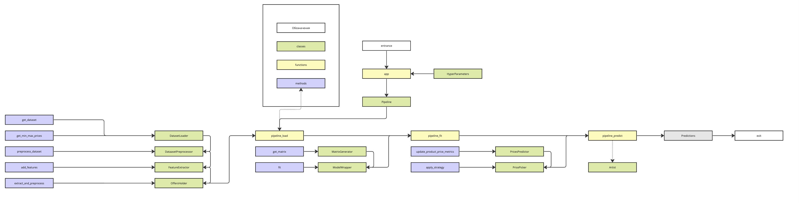

# Dynamic Pricing Prediction

### Мотивация

Одна из задач, возникающая перед поставщиками на маркетплейсках, – нахождение оптимальных цен для максимизации
прибыли. Из-за большого количества sku и факторов, влияющих на оптимальную цену, – это сложная задача.

Один из способов решить эту проблему – использовать машинное обучение. Существует уже стандартизированная задача:
Dynamic Pricing Prediction. Модель предсказания спроса, описанная ниже, построена на идеях DPP.

## Общая схема работы

1. На вход поступает датафрейм [дата x магазин x товар[спрос x цена x ...]]
2. Датафрейм предобрабатывается
3. Формируются матрица фичей
4. Модель обучается
5. Происходит предсказания на n дней вперед с разными ценами
6. Согласно заданной стратегии выбирается оптимальная цена

## Основные классы датасета

0. HyperParameters
1. DatasetLoader
2. DatasetPreprocessor
3. FeatureExtractor
4. MatrixGenerator
5. OffersHolder
6. ModelWrapper
7. Predictor
8. PricePicker
9. Pipeline

## Структура датасета

Датасет должен удовлетворять определенным инвариантам для корректной работы.

У датасета существует 3 основных типов колонок:

1. Стэковые – фичи, которые будут использоваться для стэкинга фичей (спрос, цена, промо)
2. Одинарные – фичи, которые будут браться только на день предикта (дни недели, праздники, промо)
3. Обновляемые фичи – фичи, которые необходимо обновлять во время предсказаний (скользящие средние, разницы цен)

Фичи должны располагаться в таком порядке указанном выше.

## Основные моды для обучения / предсказания

1. Существует 2 разных датасета: simulated data, real data. Все нововведения прогоняются сначала на simulated data, а
   затем выводятся на real
2. real data можно подгружать с сервера или локально (так же можно обновить локальную дату с помощью подгруженной на
   сервере)
3. Можно предсказывать на будущие n дней (для прода), или предсказывать на последние n дней, которые есть в датасете,
   чтобы сравнить результаты
4. Можно включить отрисовку

## Технический pipeline модели

[Pipeline в miro](https://miro.com/welcomeonboard/am94eWlpbUp5R1hKRXN0bjRBaHVLb3JicXJMMjBpejhyQ2xwbW1WSnM2T3d6NDhvRHJBbHN2dGU1WnFXaVNEbHwzMDc0NDU3MzU2NzEyOTczNDU2fDI=?share_link_id=753978232108)

## Расширенный pipeline модели

[Pipeline в miro](https://miro.com/app/board/uXjVNWlGkLc=/?share_link_id=184835811366)

## Заключение

Модель принимает на вход датасет, а на выход отдает дикт {offer_id : price} – рекоммендованные цены для офферов на следующий день.